# Results from DRAEM and AAE on MRI scans

DRAEM used the Describable Texture Dataset (DTD) for the synthetic anomalies.
No other methods for better synthetic anomalie generation (e.g. MemSeg) were tested.

### Absent Septum
**DRAEM**:
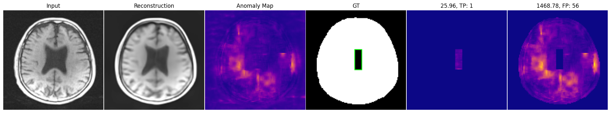
**AAE**:
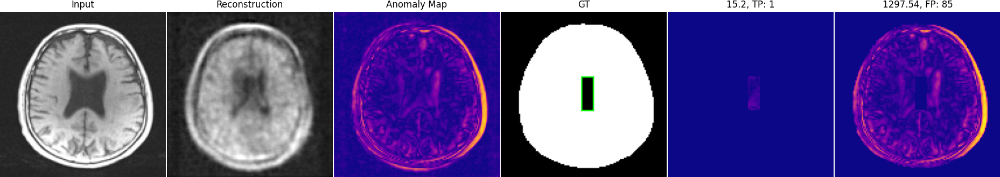

### Artefacts
**DRAEM**:
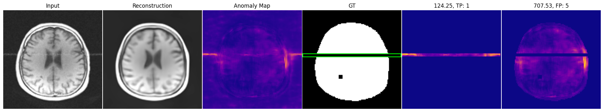
**AAE**:
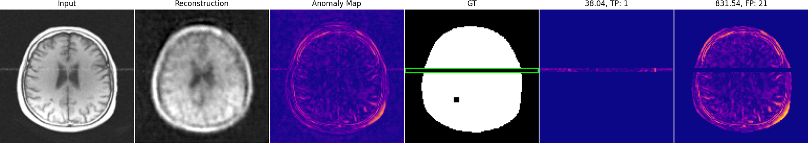

### Craniatomy
**DRAEM**:
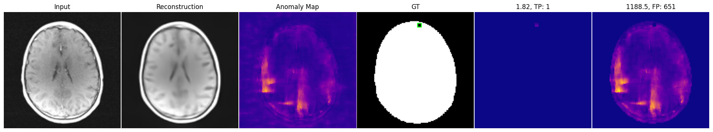
**AAE**:
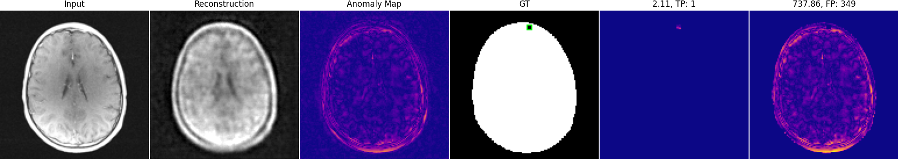

### Dural
**DRAEM**:
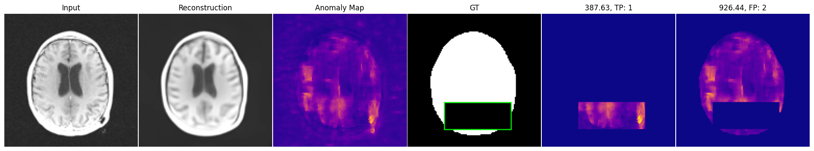
**AAE**:
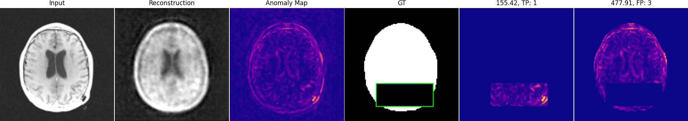
### EA Mass
**DRAEM**:
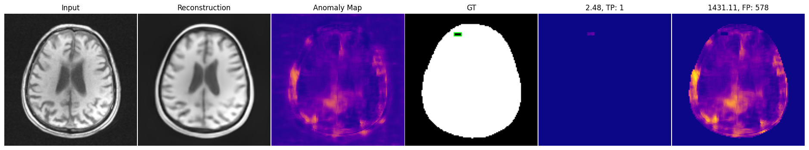
**AAE**:
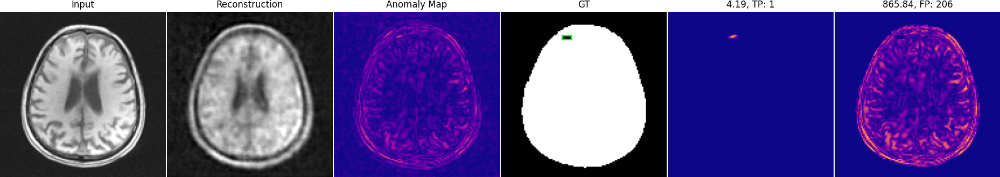

### Edema
**DRAEM**:
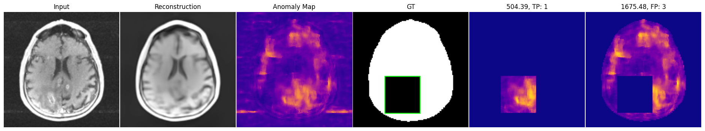
**AAE**:
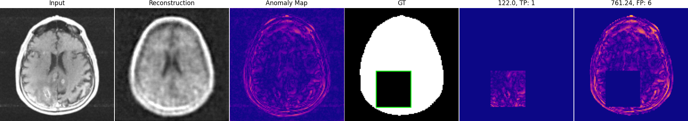

### Encephalomalacia
**DRAEM**:
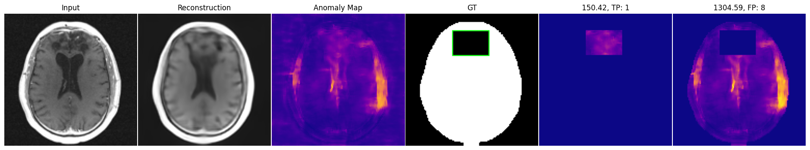
**AAE**:
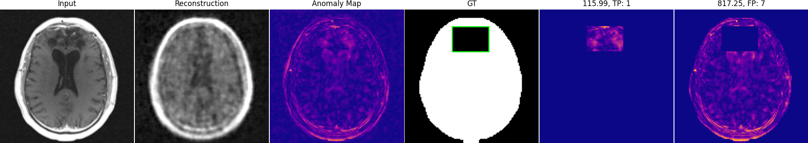

### Enlarged ventricles
**DRAEM**:
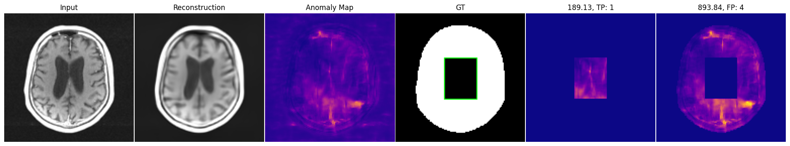
**AAE**:
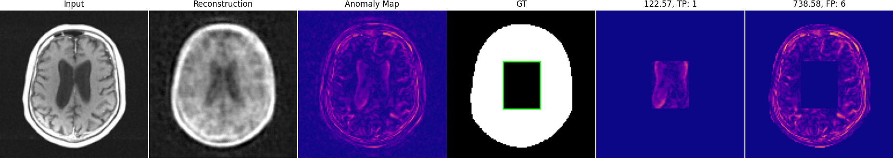

### Intraventricular
**DRAEM**:
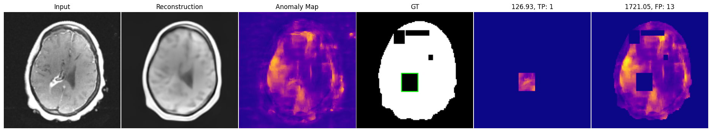
**AAE**:
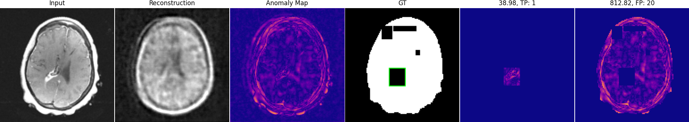

### Lesions
**DRAEM**:
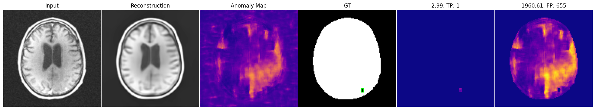
**AAE**:
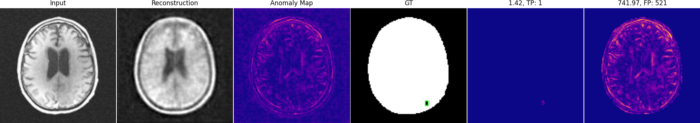

### Mass
**DRAEM**:
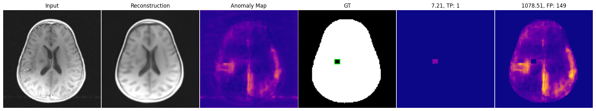
**AAE**:
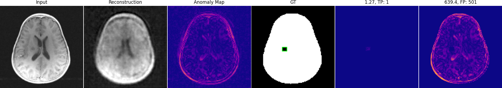

### Posttreatment
**DRAEM**:
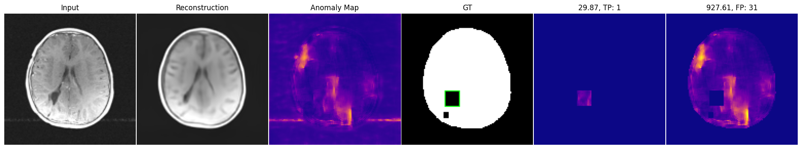
**AAE**:
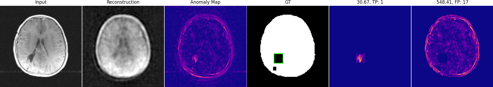

### Resection
**DRAEM**:
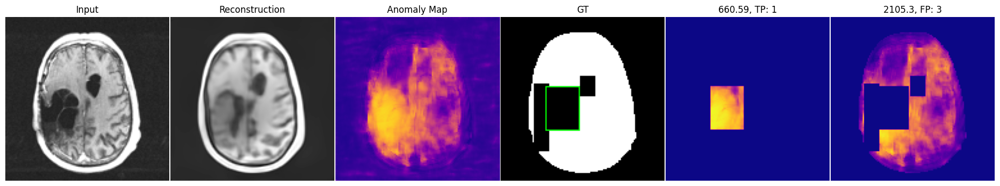
**AAE**:
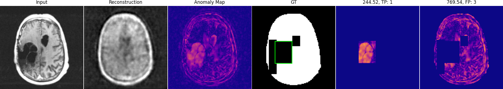

### Sinus
**DRAEM**:
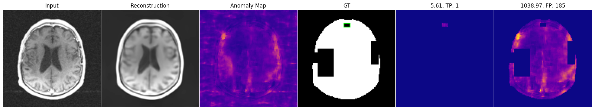
**AAE**:
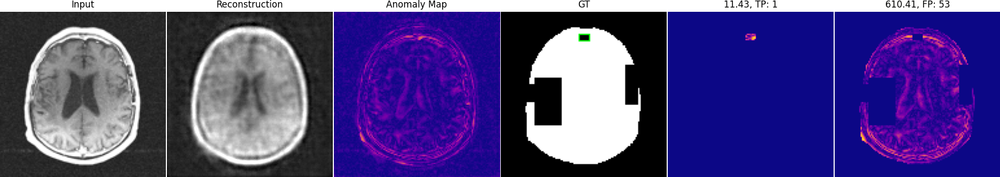

### WML
**DRAEM**:
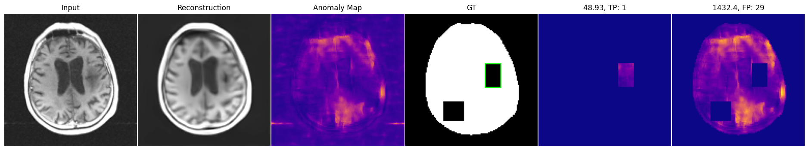
**AAE**:
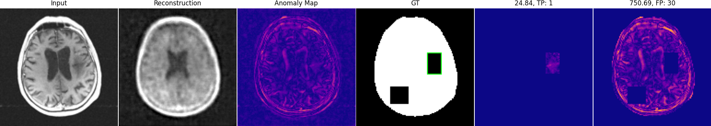